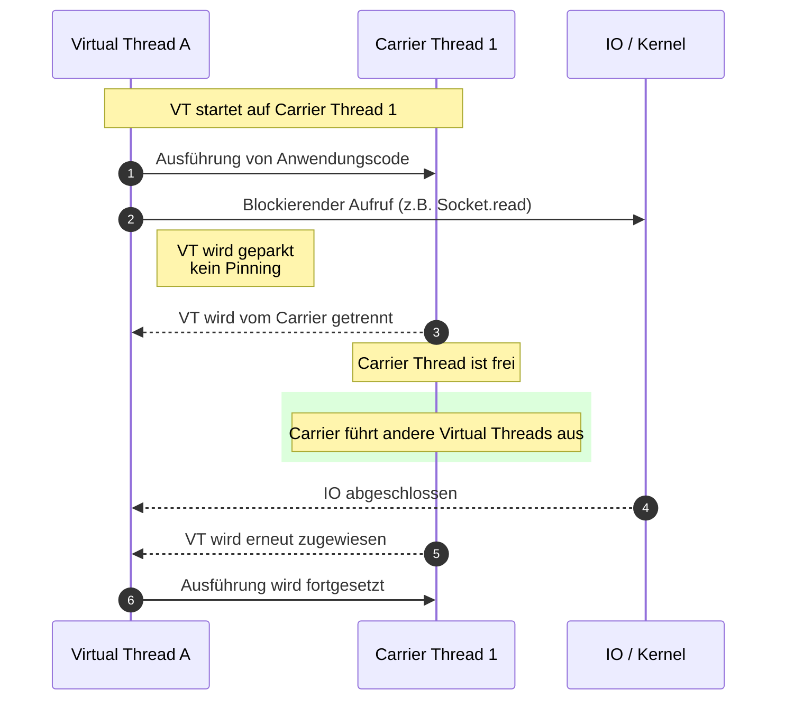
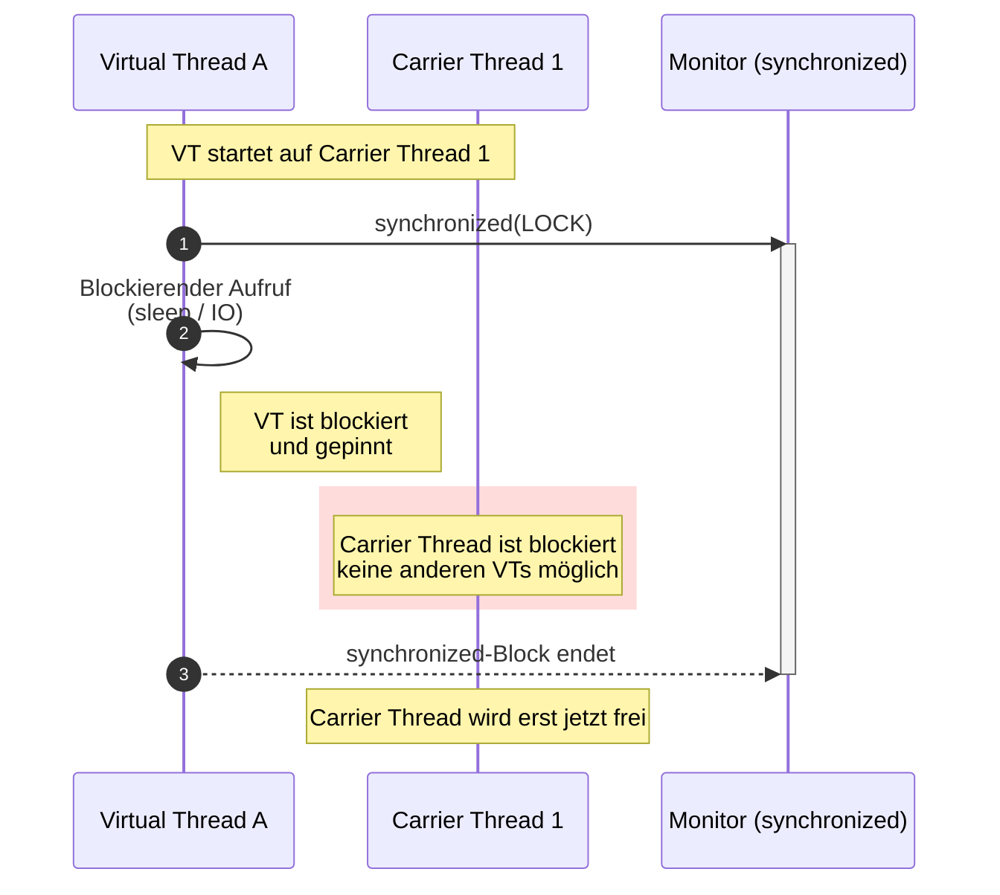

# Pinned vs. Unpinned Virtual Threads – Visualisierung mit Mermaid

Dieses Kapitel erklärt den Unterschied zwischen **unpinned** und **pinned**
Virtual Threads mithilfe von **Mermaid-Diagrammen**, die direkt in Markdown
gerendert werden können (z. B. auf GitHub, in Docs, Wikis oder IDEs).

Gültig für **Java 21+ (Project Loom)**.

---

## 1. Kontext: Warum diese Visualisierung wichtig ist

Virtual Threads skalieren nur dann gut, wenn sie:

- bei blockierenden Operationen **vom Carrier Thread getrennt**
- später **auf einem beliebigen Carrier fortgesetzt** werden können

Das nennt man **unpinning**.

**Pinning** verhindert genau das – und ist oft die Ursache für schlechte
Skalierung trotz Virtual Threads.

---

## 2. Unpinned Virtual Thread (Idealzustand ✅)

### Beschreibung

- Virtual Thread führt Code aus
- trifft auf blockierende Operation (z. B. IO)
- JVM parkt den Virtual Thread
- Carrier Thread wird **freigegeben**
- andere Virtual Threads können laufen

---

### Mermaid-Diagramm: Unpinned

---

## 3. Pinned Virtual Thread (Problemfall ❌)

### Beschreibung

- Virtual Thread läuft in einem `synchronized`-Block
- innerhalb davon tritt eine blockierende Operation auf
- JVM kann den Virtual Thread **nicht parken**
- Carrier Thread bleibt blockiert

---

### Mermaid-Diagramm: Pinned

---

## 4. Direktvergleich (konzeptionell)

| Aspekt | Unpinned | Pinned |
|------|--------|--------|
| Blockierung | VT wird geparkt | VT blockiert |
| Carrier Thread | frei | gebunden |
| Skalierung | hoch ✅ | schlecht ❌ |
| Ursache | Loom-aware APIs | `synchronized`, JNI |
| Verhalten | modernes Loom-Modell | klassisches Thread-Modell |

---

## 5. Typische Ursachen im Diagramm

- ❌ `synchronized` + `Thread.sleep()`
- ❌ `synchronized` + blockierendes IO
- ❌ JNI / native Methoden
- ✅ `ReentrantLock`, `Semaphore`
- ✅ IO ohne Monitor

---

## 6. Merksätze für dein Tutorial

> **Unpinned bedeutet: Virtual Thread kann seinen Carrier verlassen.**

> **Pinned bedeutet: Virtual Thread klebt am Carrier fest.**

> **Pinning macht aus Virtual Threads wieder klassische Threads.**

---

## 7. Einsatz dieses Kapitels

Dieses Kapitel eignet sich perfekt für:

- Loom- / Virtual-Threads-Tutorials
- Architektur-Dokumentationen
- Schulungen & Slides (Diagramme 1:1 übernehmbar)
- Code-Reviews (als Referenz)

---

## 8. Hinweis zu Mermaid-Support

- GitHub: ✅
- IntelliJ Markdown Preview: ✅
- VS Code (mit Mermaid-Plugin): ✅
- PDF-Exporter: abhängig vom Tool

---

Ende des Kapitels.
